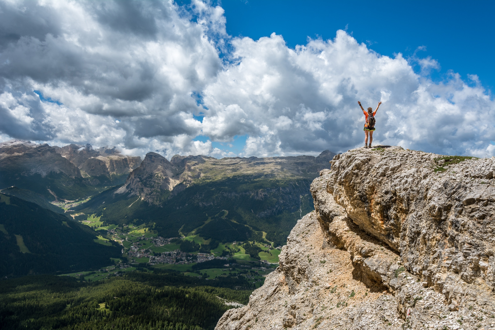
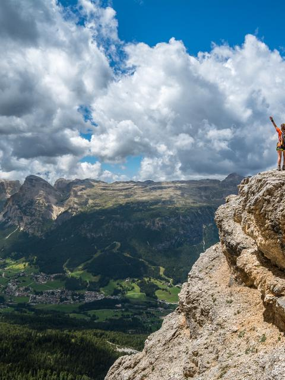

# imageresizer

***Warning**: at an early stage of development, NOT suitable for production use.*

Prototype of a image resizing server written in Go. 

I decided to write this software after dealing with image thumbnailing at
scale (15 million images, multiple thumbnail sizes, 500k new images
per month) at work.

`imageresizer` attempts to address the image thumbnailing needs of a company 
such as the one I work for:

- High volume of basic resize operations. Fast resizing is a must.
- Caching of thumbnails and originals, to avoid hitting S3 continuously ($$$).
  Caches should use LRU or LFU with a maximum on-disk size.
- Ease of deployment and maintenance. No supervisors or http servers.
- New deployments should incur near-zero downtime.


## Getting started

Building and running the code:

Install `libvips` (minimum required version is **v8.5**, due to the fact that 
we use `vips_thumbnail_buffer` and `libvips`' new sequential mode).

- Windows: https://jcupitt.github.io/libvips/install.html
- Mac: `brew install vips`
- Ubuntu 18.10: you will need `libvips-dev`.
- Debian: `libvips-dev` from `testing` or `unstable`. [How to install packages from Debian testing.](https://we.riseup.net/debian/installing-testing-packages-on-stable)
- Fedora 27+: `vips`

If you run an older version or another distro: just compile `libvips` following the official instructions (very easy to do, it takes 60 seconds):

[Building libvips from a source tarball](https://jcupitt.github.io/libvips/install.html)

Then:

This project uses Go 1.11's new go modules, if you don't have Go 1.11 yet,
run `make dep` to get the dependencies first.

```bash
make
./imageresizer
```

URL format:

```
/{width:[0-9]+}x{height:[0-9]+}/crop/{gravity}/{path}
/{width:[0-9]+}x{height:[0-9]+}/fit/{extend}/{path}
```

Supported resize operations:
- `crop`: resize cropping the edges.
- `fit`: resize without cropping (make image smaller if needed).

At the moment, only two `gravity` settings are supported:
- `s`: smart
- `c`: center

Supported `extend` settings (fit then extend edges until target size):
- `0`: do not extend image
- `rrggbb`: rgb color in hex format, e.g. `ffdea5`.

## Features

- Fast resizes using libvips through a cgo bridge (JPEG and PNG)
- Local caching of originals and thumbnails with approximate LRU eviction based on file atimes.
- Smart cropping.
- Image uploads and deletions.
- S3 storage support.
- Graceful zero-downtime upgrades/restarts.
- 304 Not Modified responses.

## Examples

Photo | Result
------|--------
[Original](https://unsplash.com/photos/yUWKDfPLp6w) [*@samuelclara*](https://unsplash.com/@samuelclara) (2400x1600) | 
`480x640/crop/s` | 
`480x640/crop/c` | 
`480x640/fit/0` | 
[Original](https://unsplash.com/photos/BqD0Id4qemc) [*@natcatalyst*](https://unsplash.com/@natcatalyst) (3456×5184) | 
`300/crop/s` | 
`500/fit/000000` | 


## Configuration properties
Put your configuration properties inside a `config.properties` file in the same directory as the imageresizer executable. The config below contains the default values:

```ini
# Listen address
server.addr=:8080

# File storage settings
local.prefix=./images/originals

# S3 settings
s3.enable=false
s3.region={S3 region}
s3.bucket={bucketName}
s3.prefix="" # root path of original images

# Caches
cache.orig.enable=true
cache.orig.path=./images/cache
cache.orig.maxsize=1G
cache.orig.shards=256
cache.thumb.enable=true
cache.thumb.path=./images/thumbnails
cache.thumb.maxsize=1G
cache.thumb.shards=256
cache.loader.sleep=50
cache.loader.files=100
cache.loader.threshold=200

# Uploads
upload.maxsize=50M

# Etag cache size (num items)
etag.cache.enable=true
etag.cache.maxsize=50000
```

## Roadmap

In order of priority:

- Older libvips (<8.5) compatibility.
- WEBP and GIF support?
- Security controls for uploads and deletions?
- Secure links?
- Cache sharding.
- LFU instead of LRU.


## Acknowledgements

* [libvips/libvips](https://github.com/libvips/libvips): A fast image processing library with low memory needs.
* [gorilla/mux](https://github.com/gorilla/mux): A powerful URL router and dispatcher for golang.
* [cloudflare/tableflip](https://github.com/cloudflare/tableflip): Graceful process restarts in Go
* [spf13/viper](https://github.com/spf13/viper): Go configuration with fangs
* [djherbis/atime](https://github.com/djherbis/atime): Access Times for files
* [rcrowley/go-metrics](https://github.com/rcrowley/go-metrics): Go port of Coda Hale's Metrics library
* [h2non/bimg](https://github.com/h2non/bimg): Small Go package for fast high-level image processing powered by libvips C library
